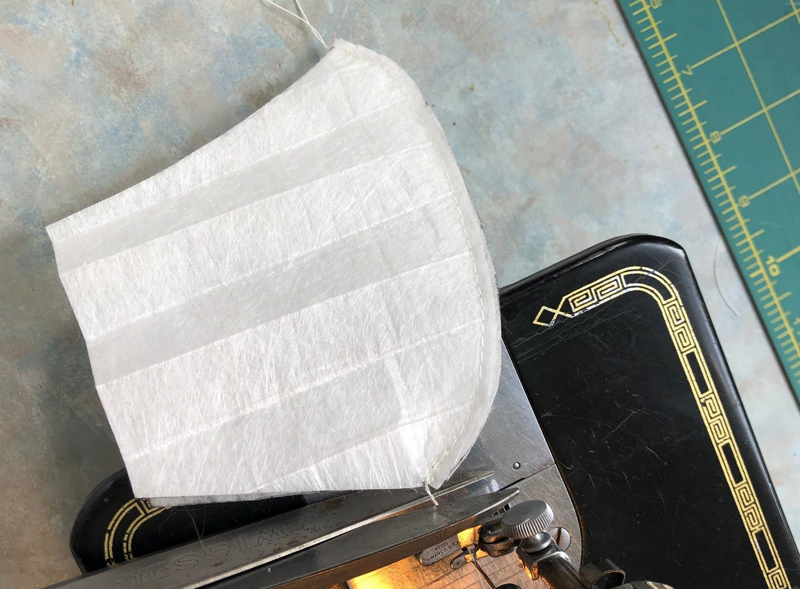
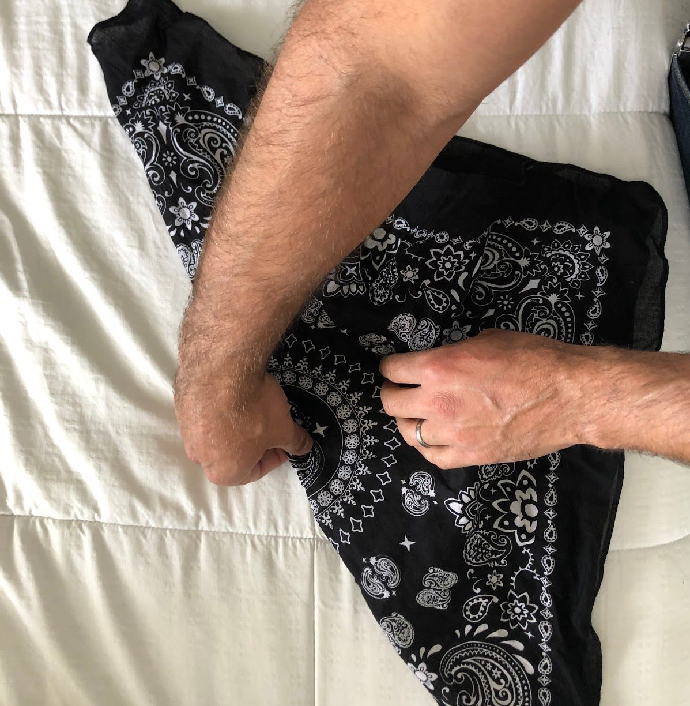
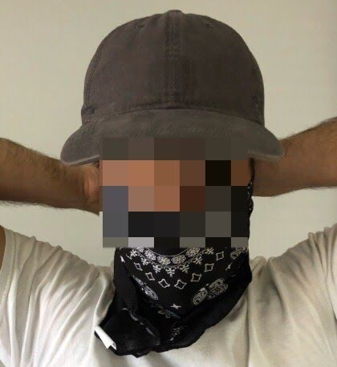
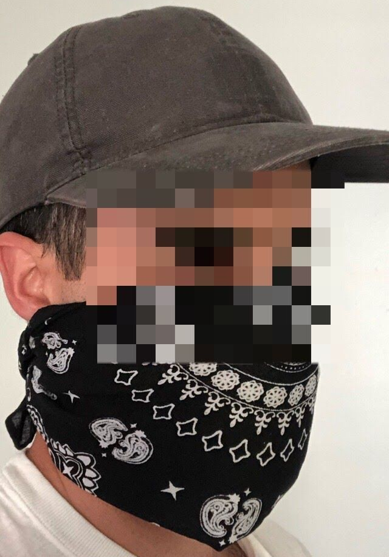

I decided to try and make the simplest most effective mask that anyone could make. If you just got a sewing machine or barely know how to use your sewing machine this will be very easy to make. If you know what you're doing you can make a much better mask than this. This is for people who don't have time to learn sewing construction.

You will need:

- Sewing machine and thread of any kind
- Scissors or any craft knife
- A pen
- A bandana or face wrap
- A disassembled​ [Filtrete 1500](https://low.es/2XnFe2T) or higher AC filter
- **Print** [this sewing pattern](https://freesewing.org/fu-facemask-freesewing.org.a4.pdf)​ (use the small size one and disregard all the text we are going to simplify this a lot)

_NB. Filtrete 1500 or greater is manufactured specifically to filter viruses, for this reason I think this is a far safer option than just wearing a bandana or other cotton masks. Your mileage may vary but these are what i'm wearing._

## 1. PREPARE THE SEWING PATTERN & AC FILTER MATERIAL

Cut out the printed sewing pattern. Cut on the line. There's no need to add a seam allowance.

Place the cut out sewing pattern over a sheet of the AC filter material. Use a pen to trace the sewing pattern onto the filter material.

_You will need two pieces of cut AC filter material for your mask, so make sure to trace the pattern twice._

Next, we'll cut out the filter material.

## 2. CUT THE AC FILTER MATERIAL

Cut out the pattern you've just traced onto the AC filter material. You can use scissors or an exacto knife. This stuff is easy to cut so use whatever you have on hand.

_These are the two pieces of filter material you need for your mask._

We'll need to do just a little sewing for the next step.

## 3. Sew the filter pieces together

Place the two pieces on top of each other as shown below (line up the longer, curved ends, so that each piece completely covers the other)

Sew along the long curve. This is a pretty basic stitch and you could probably even do it by hand if you needed to.

Now, to put it together.

## 4. Assemble the mask

At this point all you do is take the filter piece you've sewn together and place it between two layers of a bandana or face wrap. You don't really want this filter material against your skin, you will want it sandwiched between cotton (it's safe but uncomfortable against skin). There is no real need to make a special cloth holder for the mask. The filter should create a cup shape that molds to your face and when tied inside a bandana it stays in place easily.

Let's put this thing to use.

## 5. Wearing the mask

You can wear this any way you want, but here are three options:

1. Place the filter inside a folded in half bandana and tie. Super simple
   
   
   
2. Fold the bandana in half like above and then fold the bottom back up so the filter is locked into the bandana
   
   
3. Use a neck gaiter, Just make sure the filter is between two folded layers.
   

## Some final thoughts...

I'm sure there are better mask designs out there. This is for people who maybe don't know how to sew or are just learning but want something better than a simple piece of cotton between them and global pandemic.

Some other things you can do to make this work better:

- The WHO recommends that masks be sprayed with citric acid to make the outer layer inhospitable to viruses. I'm told that spraying the outside with lemon juice and letting it dry is a decent option. Not sure if I totally believe this but it might be worth trying.
- I would make sure to wash the bandana daily in hot water if you're going out a lot.

Stay safe.

Love and Solidarity.
