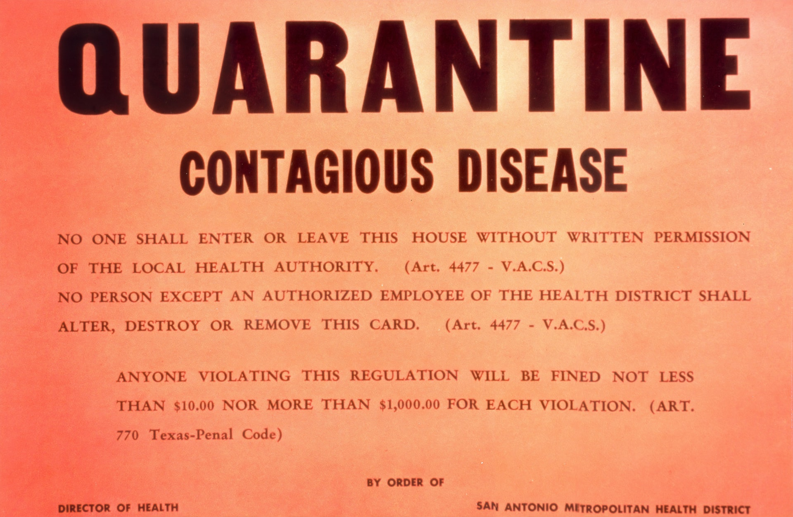

## Update April 10th, 2020: [new directives issued April 6th](https://newsroom.courts.ca.gov/news/judicial-council-adopts-new-rules-to-lower-jail-population-suspend-evictions-and-foreclosures)

On April 6th, 2020, the California Judicial Council adopted [new rules](https://caanet.org/app/uploads/2020/04/20-141-Adoption-of-Emergency-Rules-FINAL.pdf) to protect tenants.

These rules **directly prevent tenants from being evicted for failure to pay rent.**

Under the new rules, [courts are not allowed to start the eviction process](https://www.sfchronicle.com/news/amp/California-halts-tenant-evictions-statewide-15183200.php), except for cases that regard maintaining public health.

If you can't pay rent, **don't pay rent,** and inform your landlord within at least 7 days of your rent due date that you can't pay. **You do not have to provide proof to your landlord that you can't pay.**

With millions unemployed or underpaid due to the pandemic, and nearly a third of apartment renters unable to pay their rent currently, landlords understand that they're forcing tenants to choose between rent and other necessities like food or medicine.

Expectations that tenants pay back any rent payments that are "missed" during this period are slowly eroding too, as landlords, politicians, and the courts accept the reality that the resulting economic crisis of this pandemic will make it virtually impossible for tenants to pay this amount back.

Besides that, we should refuse outright to enter into debt to our landlords as the price for shelter that we are demanded to take in order to maintain the public health, and we should continually fight back against the commodification of housing that allows landlords to extract profits from tenants and push people out onto the streets, where they face even more danger.

_This post has been updated with the latest information on California's response to the pandemic. Some of the below informaion may not be accurate as of April 10th, 2020._



**Keep your rent.**

Or, at least, consider it.

If you're living in Long Beach, chances are your rent is, at minimum, somewhere in the range of $600 - $800. That's with a roommate, and if you're lucky. Most of us are shelling out somewhere closer to \$1000, every month, just for shelter. A place to live.

We have car payments for our cars, payments for debt and loans, and, on top of all that there's rent: the one big slap-in-the-face payment you make every month.

In the midst of a global pandemic, we think there are several reasons you might want to consider keeping your rent:

- You lost work, may lose work, or can't work, and money for rent is better spent on food
- You lost work, may lose work, or can't work, and you _can't_ pay rent
- You are standing in solidarity with those who can't pay rent, for one of the above or any variety of other reasons

We could get new jobs, of course, but for those of us particularly vulnerable to COVID-19, the risk of the virus stands as another deterrent (besides the nature of work itself) to rejoining the workforce, and for those of us not vulnerable, well, maybe we just don't like working. Or rent.

Threats of evictions and landlord retaliation and the risk therein make the idea of not paying rent a dauting one. Here are some resources to help you get away with it:

### RULE #1: THE MORE OF US, THE BETTER

They can't evict all of us.

The best advice of any of these resources is that we are stronger together, and more of us acting together means more chance of us winning and coming away from the pandemic with more dignity, more cash, and networks of care that sustain us through future crises.

## More Resources

_Please note: the following resources may not have the most accurate information regarding laws and tenant protections **specific to your area**._

_If there is a local tenant's union or legal aid group in your area, check with them._

### [The Tenants Will Win: TANC Pandemic Organizing Guide](https://docs.google.com/document/d/1osMMHmOn3nyhx3Or4HzKtRaeaRAyEDwnQRAtVDgt47c/edit) &mdash; by Bay Area group **[Tenants And Neighborhood Councils](https://baytanc.com/)**

> COVID-19 is not only a health crisis, but an economic and political crisis too. The current crisis is largely due to government negligence and the inability for capitalism to meet our basic needs. We need our needs met first and foremost.

### [FOOD OR RENT? FOOD NOT RENT!](https://docs.google.com/document/d/165eYVkW13yzrES7q5ZZaWVFSLFYqYnP2RBzhyQSRIWM/edit) &mdash; A step-by-step guide to rent forgiveness for tenants by **[Los Angeles Tenants Union](https://latenantsunion.org/en/)**

> We do not know how long we will be out of work and confined to our homes. We do not trust the federal or state governments to provide the resources we need to survive. We recommend saving your rent money for basic necessities, food and medications. We need whatever money we have. We can’t eat the rent.

### [COVID-19 Tenant Organizing Toolkit](https://docs.google.com/document/d/1sX0VYYXS0ygaQelcvfY2svhGE_z7Bv_rHHVwggNUfc9/edit) &mdash; by Chicago group **[Autonomous Tenants Union](https://twitter.com/AutonomousUnion)**

> Unstable housing is exacerbating this crisis. If tenants know that missing rent could result in eviction proceedings, they’ll be more likely to go to work with symptoms and risk getting others sick. Tenants forced to move face a higher risk of spreading and/or contracting the virus, along with difficulty securing new housing, renting moving trucks, hiring movers, or finding volunteers to help. It is our responsibility to protect each other. In the absence of compassionate leadership from our government, we must organize together to ensure our basic needs are met.

### Sample Letter for Long Beach Tenants

Based off the letter in Tenants And Neighborhood Councils Organizing Guide above.

[Here's an external link to an online editor with the letter text](https://pad.riseup.net/p/r.9e507769566c52708c97dc0525c986cc)

<iframe name="embed_readwrite" src="https://pad.riseup.net/p/r.fb719ef6ac3bc718a074655beac37728?showControls=true&showChat=true&showLineNumbers=true&useMonospaceFont=false" height="600" width="100%"></iframe>

```
Dear [Landlord],

We regret to inform you that, due to the COVID-19 pandemic emergency, many of us have lost income. We are trying to stay healthy and prevent others from getting sick during this public health crisis. An adequate response to this public health crisis means keeping people in their homes, confident that losses of income will not lead to harassment or eviction.

We are taking extra precaution to ensure that all tenants can remain safe. In this spirit, we have formed a tenant’s council (also known as tenant’s association) so that we may represent our collective interests as your tenants.

In addition to notifying you about the establishment of the tenant’s council, we are writing you to request:

    A rent reduction of 60% until the health & economic crisis has abated.

    No expectation of repayment of the reduced rent amount after we return to full rent payments.

    [Don't be afraid to brainstorm your own demands!]

We do not make these requests lightly. As you are aware, the State of California declared a state of emergency on March 4, 2020 in response to the pandemic COVID-19. The number of cases testing positive has continued to rise exponentially by the day with no end in sight. As a result, many businesses have been forced to reduce normal business operations, cut hours/shifts, and/or require their employees to work from home. Most school districts in the state have also followed suit and closed their doors to curb the rapid spread of the virus.

On March 15 Governor Newsom took unprecedented action in ordering all bars, breweries, and wineries in the state to close, regardless of their size, for an indeterminate amount of time. The order also suggested restaurants cut their occupancies by 50% and transition to a take-out model. The next day,LA County issued a "stay at home" order mandating all residents to remain at home and away from others through mid April--given the trajectory of events it is very likely this order will be extended. The City of Long Beach followed with a more restrictive order on March 28 that effectively bans leaving our homes except to buy food, get medical care, or go to work at a job defined as “essential”.

On March 25 the City of LB issued an emergency eviction moratorium related to COVID-19. It states that no rent is required to be paid through May 31 if a household has lost income due to the pandemic. The city has also worked out a deal with banks to stop mortgage payments. Our Mayor said this: “We’re just starting to see the economic impacts of COVID-19 on our residential and commercial tenants in Long Beach. The emergency ordinance enacted by the City Council should provide relief to those who are most vulnerable to eviction and possible homelessness during this difficult time.”

Our households have lost significant income and entire jobs due to this crisis. We are taking all steps we can such as applying for unemployment, borrowing money, trying to find alternative work, etc. But the long and short of it is that we simply cannot afford to pay the entire amount of rent. This is why we are reaching out to you in good faith.

Following this overwhelming situation, we hope you will do the right thing. Many of us are fearful for our health, let alone our livelihoods. Because of the menacing health situation produced by this pandemic, we are prepared to defend our housing in our capacity as a Tenant’s Council. Your consideration and kindness is greatly appreciated during this larger global moment.

Signed,

[your tenant's council]

```
